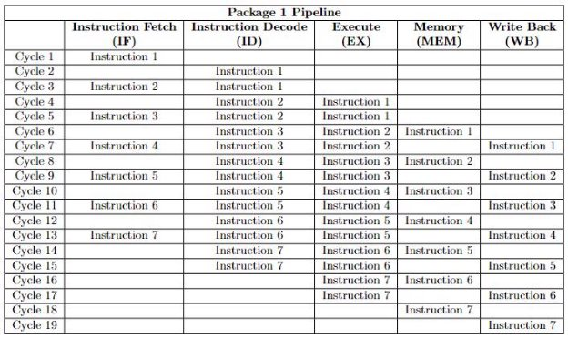

**Faculty of Media Engineering and Technology  Computer Systems Architecture – CSEN601**  

***Project General Description ***

***Project Overview*** 

“Processor design is the design engineering task of creating a processor, a key component of computer hardware. The design process involves choosing an instruction set and a certain execution paradigm, and results in a microarchitecture. The mode of operation of any processor is the execution of lists of instructions. Instructions typically include those to compute or manipulate data values using registers, change or retrieve values in read/write memory, perform relational tests between data values and to control program flow.” 

In this project, you will simulate a fictional processor design and architecture using C. You are asked to choose one of four processor packages described in the upcoming sections. 

***Detailed Description*** 

**Packages Description** 

Package 1: Spicy Von Neumann Fillet with extra shifts *Memory Architecture* 

1) **Architecture**: Von Neumann 

` `Von Neumann Architecture is a digital computer architecture whose design is based on the concept of stored program computers where program data and instruction data are stored in the same memory. 

2) **Memory Size**: 2048 \* 32

- The main memory addresses are from 0 to (2^11) - 1 (0 to 2047). 
- Each memory block (row) contains 1 word which is 32 bits (4 bytes). 
- The main memory is word addressable. 
- Addresses from 0 to 1023 contain the program instructions. 
- Addresses from 1024 to 2048 contain the data. 
3) **Registers**: 33 
- Size: 32 bits 
- 31 General-Purpose Registers (GPRS) 
  - Names: R1 to R31 
- 1 Zero Register 
  - Name: R0 
  - Hard-wired value “0” (cannot be overwritten by any instruction). 
- 1 Program Counter 
- Name: PC 
- A program counter is a register in a computer processor that contains the address (location) of the instruction being executed at the current time. 
- As each instruction gets fetched, the program counter is incremented to point to the next instruction to be executed. 

*Instruction Set Architecture* 

1) Instruction Size: 32 bits 
1) Instruction Types: 3
3) Instruction Count: 12 
- The opcodes are from 0 to 11 according to the instructions order in the following table: 

- SLL and SRL: R3 will be 0 in the instruction format. 

“||” symbol indicates concatenation (0100 || 1100 = 01001100) 

*Data Path* 

1) Stages: 5 
- All instructions regardless of their type must pass through all 5 stages even if they do not need to access a particular stage. 
- **Instruction Fetch (IF):** Fetches the next instruction from the main memory using the address in the PC (Program Counter), and increments the PC. 
- **Instruction Decode (ID):** Decodes the instruction and reads any operands required from the register file. 
- **Execute (EX):** Executes the instruction. In fact, all ALU operations are done in this stage. 
- **Memory (MEM):** Performs any memory access required by the current instruction. For loads, it would load an operand from the main memory, while for stores, it would store an operand into the main memory. 
- **Write Back (WB):** For instructions that have a result (a destination register), the Write Back writes this result back to the register file.
2) Pipeline: 4 instructions (maximum) running in parallel 
- **Instruction Fetch (IF)** and **Memory (MEM)** can not be done in parallel since they access the same physical memory. 
- At a given clock cycle, you can either have the **IF**, **ID**, **EX**, **WB** stages active, or the **ID**, **EX**, **MEM**, **WB** stages active. 
- Number of clock cycles: 7 + ((n − 1) ∗ 2), where n = number of instructions 
- Imagine a program with 7 instructions: 
  - 7 + (6 ∗ 2) = 19 clock cycles 
- You are required to understand the pattern in the example and implement it.

- The pattern is as follows: 
- You fetch an instruction every 2 clock cycles starting from clock cycle 1. 
- An instruction stays in the Decode (ID) stage for 2 clock cycles. 
- An instruction stays in the Execute (EX) stage for 2 clock cycles. 
- An instruction stays in the Memory (MEM) stage for 1 clock cycle. 
- An instruction stays in the Write Back (WB) stage for 1 clock cycle. 
- You can not have the Instruction Fetch (IF) and Memory (MEM) stages working in parallel. Only one of them is active at a given clock cycle. 

***Deliverables*** 

The following guidelines must be followed in all packages: 

**Program Flow** 

1) You must write your program in **assembly language** in a text file. 
1) Your must read the instructions from the text file, and parse them according to their types/formats (opcode and other relevant fields). 
1) You must store the parsed version of the instructions in the memory (instruction segment of main memory or instruction memory according to your package). 
1) You should start the execution of your pipelined implementation by fetching the first instruction from the memory (instruction segment of main memory or instruction memory) at Clock Cycle 1. 
1) You should continue the execution based on the example provided in the Datapath section of each package reflecting the different stages working in parallel. 
1) The Clock Cycles can be simulated as a variable that is incremented after finishing the required stages at a given time. 

   Examples: 

Fetch(); 

Decode(); 

Execute; 

// memory(); 

// writeback(); 

Cycle++ 

**Printings** 

The following items must be printed in the console after each Clock Cycle: 

1) The Clock Cycle number. 
1) The Pipeline stages: 
- Which instruction is being executed at each stage? 
- What are the input parameters/values for each stage? 
1) The updates occurring to the registers in case a register value was changed. 
1) The updates occurring in the memory (data segment of main memory or data memory according to your package) in case a value was stored or updated in the memory.
3) The content of all registers after the last clock cycle. 
3) The full content of the memory (main memory or instruction and data memories according to your package) after the last clock cycle. 

***Package Selection*** 

- You are requested to submit your selection of one of the previously described packages through the link: [https://docs.google.com/forms/d/e/1FAIpQLSdIA9pE1yQLsBU7aLz1l- PYCFFP4Rnb9x8UkURh9XqHf3v85Q/viewform?usp=sf_link ](https://docs.google.com/forms/d/e/1FAIpQLSdIA9pE1yQLsBU7aLz1l-PYCFFP4Rnb9x8UkURh9XqHf3v85Q/viewform?usp=sf_link)  
- **Package Selection Deadline:** **Saturday 06 April 2024 at 11:59 pm** 

  *Note: Kindly note that the final assignment will be based on the first come first serve basis to ensure equal distribution of all packages among the teams* 

- You can check your assigned package through the link: [https://docs.google.com/spreadsheets/d/1YYNIWAF_e041cuAKfjcy7hnPAgW90Bqdipq_ zeUq7RM/edit?usp=sharing ](https://docs.google.com/spreadsheets/d/1YYNIWAF_e041cuAKfjcy7hnPAgW90Bqdipq_zeUq7RM/edit?usp=sharing) 

***Project Instructions*** 

Please read the following instructions carefully: 

1) Any case of plagiarism will result in a zero. 
1) Any case of cheating will result in a zero. 
1) A cheating detection tool will be used to compare the submitted projects against all online and offline implementations similar to the project idea. 
   1. The projects that have more than 50% similarity percentage will receive a zero. 
1) It is your responsibility to ensure that you have: 
- Submitted before the deadline. 
- Submitted the correct file(s). 
- Submitted the correct file(s) names. 

***Submission Guidelines*** 

- The submission deadline for submission is **Thursday 16 May 2024 at 11:59 PM** 
- You are requested to submit the following documents: The below deliverables are the ones that will be described in the deliverables section, and below is just examples of the deliverables and the naming convention (video and report is a MUST, we can add extra deliverables which are codes etc)
1. A 1-min video to demonstrate the working code (please narrate and comment on the results)**  
- **name the Video (Project\_Team\_m\_Video.mp4)** 
2. The required project description report (kindly include in the cover page the team number, team name, package number and name, and team members’ names, IDs, and tutorials). 
- **name the report (Project\_Team\_m\_Report.pdf)** 
3. The developed C code of the experiment, the CMakeLists.txt, and any additional library used in a single zip folder 
- **name the Code (Project \_Team\_m\_Code.zip)** 
- Please upload your milestone deliverables to your drive as a .zip file with the following naming format: 

(Ex.: CSEN601\_S24\_Proj\_Package\_**n**\_Team\_**m**.zip) 

*where **m** is your team number and **n** is your package number.* 

- Submit **ONLY** the sharing link through the below form and ***Make sure that you give permission to access*** 
  - [https://docs.google.com/forms/d/e/1FAIpQLSf8i13CHO35cdfx-W6C- JG5l2Q450BAvaus2hPrHPZS3vYk5g/viewform?usp=sf_link ](https://docs.google.com/forms/d/e/1FAIpQLSf8i13CHO35cdfx-W6C-JG5l2Q450BAvaus2hPrHPZS3vYk5g/viewform?usp=sf_link) 

***Evaluation Process*** 

- The evaluation process of the process will be conducted during the first 2-3 days of the revision week. This timing is tentative, exact timings will be announced before the evaluations. 
- The evaluation timetable will be posted on the CMS during the last teaching week. 

***Project Grading*** 

The project will be graded upon multiple criteria for each of the submitted deliverables. These criteria including *(below is just some grading items and more are considered):* 

- The overall functionality of the project. 
- Each technical aspect of the project will be graded as well. 
- The quality of the submission (for example: well-commented and generic code, comprehensive and well-written reports, clear and comprehensive videos, and others). 
- Submission on time with no delays (late submissions will be subject to deduction).
- The evaluation attendance is obligatory for all members and graded upon only the showing up. 
- There is a collective team grade, yet during the evaluation and based on your discussion and answers, individual grades will be added as well. 
- Note extra bonus marks will be added in case of successfully merging the computer systems course project and the operating systems course project (maximum bonus is 1.75% to be added to the total 100% course grade)
***CSEN 601 – Spring 24***  19/19 

[ref1]: Aspose.Words.af7bb3c6-0057-461e-a1c8-6f4e3ff06082.004.png
[ref2]: Aspose.Words.af7bb3c6-0057-461e-a1c8-6f4e3ff06082.006.png
[ref3]: Aspose.Words.af7bb3c6-0057-461e-a1c8-6f4e3ff06082.007.png
[ref4]: Aspose.Words.af7bb3c6-0057-461e-a1c8-6f4e3ff06082.008.png
